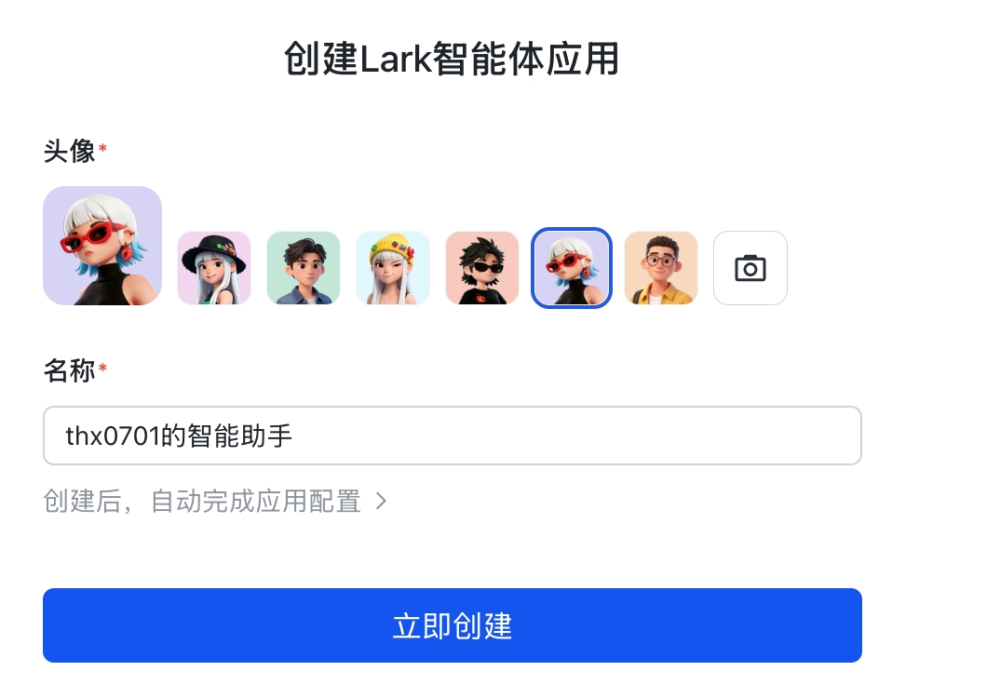

# osslab-agent — 訂閱制 AI agent 的多入口協同作業架構

> [!NOTE]
> 🤝
> **osslab-agent 是什麼：一套自架的訂閱制 AI agent 多入口架構。**
> 它把 Larksuite 群組、cc web 對話、Chrome 容器與 Claude Code CLI / Codex CLI 這類訂閱制 code agent 串成同一套工作流。短任務可以在 Lark 裡完成；研究、比價、資料整理、project context 與知識沉澱則進 cc web；需要登入真實系統時再由 Chrome 容器接手。
> 核心策略是把現成 CLI 訂閱方案當 agent runtime 調用（可合規使用訂閱制，減少 AI API 成本），必要時也能接本地 LLM / 私有知識庫，讓敏感資料留在自己控制的環境內。
> AI 不是按鈕、不是單一聊天視窗，而是**能存在於不同 channel 的同事**：能在 Lark 裡被 @，能在 cc web 裡做研究並依 project context 沉澱資料，也能操作真實 Chrome 查 ERP、寫文件、reply email、解 captcha 時求救。
> **本 repo：**`thx0701/osslab-agent` · 自架部署腳本 + chrome 容器 image

# 1. 解決什麼問題

現代辦公室每天的雜事——**查資料**（包含高變動性資料如庫存 / 物流 / 訂單狀態）、**採購**、**銷售**、**客戶聯絡**、**跑助理事務**——絕大部分都是「打開瀏覽器、登入某個系統、填表單、複製貼上、回信」。

但另一類工作也越來越常見：**查閱與研究外部資訊、比價、整理來源、把關鍵結論沉澱下來、再依 project 分流到 research / dev / it 等不同上下文**。這些事情可以在 Lark 裡對談完成，但如果全部只留在 IM 訊息流，長期會很難沉澱：來源散落、檔案和圖片混在對話裡、結論版本不清、後續要接本地 LLM / 私有檢索時 retrieval 會很髒。

傳統做法：每人開一堆分頁手動切換，或寫一堆 RPA 腳本（脆弱、難維護、跑不起來時沒人懂）。

osslab-agent 的解法是把工作拆成三層：

- **Lark 行動層**：短任務、通知、審核、人工介入。
- **cc web 研究層**：長對話、stream、圖片 / 檔案、web research、project context。
- **Chrome 執行層**：登入真實系統，操作 ERP / Email / 電商 / 文件工具，必要時讓人類接手。

這跟 openclaw / harmes 方向不同：osslab-agent 不重做模型調度核心，而是把 Claude Code CLI、Codex CLI 或其他 code agent CLI 當成可替換的訂閱制 agent process。它自己負責 channel routing、session 管理、Lark 審核、Chrome 容器、人工接手與稽核紀錄。單人可以一人 N agent，團隊也可以按角色 / 工作流 / project 拆 agent，agent 數量不跟人數綁死。

# 2. 為什麼 Larksuite 仍是關鍵行動層

osslab-agent 把 channel 抽象出來，**v1 的行動與審核層鎖定 Larksuite (飛書國際版)**，因為它是當代最好的**免費 / 付費**「團隊協作 IM」。Lark 很適合承接短任務、通知、人工審核、群組稽核與文件協作，但不把它當成唯一入口，也不把 IM 訊息流當成主要知識庫。

| 能力 | 為什麼強 |
|---|---|
| **IM** | 群組 / 私訊 / 線程 / 視訊全包，介面比 Slack 直觀，比 Teams 輕 |
| **雲端文件** | Docx / Sheet / Base / Whiteboard / Slides 全套，多人即時協作不打架 |
| **免費 Email Server** | 自有網域信箱，整合在同一個 app 裡（這在現代 Team IM 裡幾乎絕跡） |
| **行事曆 / 會議** | 會議自動轉妙記、AI 摘要、待辦自動建 |
| **免費額度** | 20 人以下完全免費，免費 Email Server + 線上文件 100G 容量 新創 / 中小團隊零成本 |
| **OpenAPI** | 所有功能都有完整 API，這就是讓 AI agent 接管的入口 |
| **Bot 平台** | 事件訂閱（WebSocket long-link）、訊息發送、互動卡片、權限分級全都有，bot 能力在當代 IM 裡屬於頂級 |

## 2.1 Lark Sheet / Base 可直接作為輕量進銷存主場

Larksuite 不只是 IM 和文件工具，**Sheet（表格）與 Base（多維表格 / 多維表單）本身就能承接很多中小團隊的進銷存、客戶、訂單、產品、庫存資料管理**。對還沒導入完整 ERP 的團隊，可以先用 Lark Base 當資料庫，用 Sheet 做試算與報表，再讓 AI agent 透過 `lark-cli` 讀寫資料、產生報告、協助查詢與更新。

- **多維表格 / 多維表單功能強大**：可用表格、看板、日曆、表單等視圖管理資料，適合把客戶、商品、庫存、採購、銷售流程先結構化。
- **進銷存可先用現成模板起步**：[Inventory Stock Sheet Template](https://www.larksuite.com/zh_tw/blog/inventory-stock-sheet-template)
- **教學參考**：[飛書多維表格 / 進銷存相關教學](https://www.feishu.cn/content/article/7582519149600017604)

這也是 osslab-agent 選 Larksuite 的關鍵原因之一：很多工作流不一定要先接 Odoo / FileMaker，**Lark Sheet + Base 就可以先成為團隊的第一版作業系統**，AI agent 直接在同一個 Lark workspace 裡讀寫資料、更新文件、產生報表。

## 2.2 cc web 是正式研究與知識入口

Lark 可以完成對談，但研究和知識沉澱更適合在 cc web 裡做。原因不是 Lark 不能用，而是 IM 訊息流天然偏「事件」：方便通知、追蹤、審核，卻不適合長期整理大量來源、圖片、檔案、草稿、版本與 project context。

cc web 在 osslab-agent 裡是正式入口，不是附屬功能；它本質上是 cc-connecter 的改版 web channel，把原本 Lark bridge 的 session / stream / tool routing 能力搬到 web 對話裡。

- **stream 對話**：長研究任務可以持續回傳進度，不必等整段輸出完成。
- **圖片與檔案輸入**：報價單、截圖、PDF、表格、產品圖、錯誤畫面可以直接進入同一個上下文。
- **來源整理**：web research 可以把查閱、比價、引用來源、結論與待查問題整理成 artifact。
- **知識沉澱**：關鍵結果保留在 cc web 的 project context，之後可接本地 LLM 做私有檢索。
- **回寫 Lark**：需要人類決策、審核、付款、登入或對外送出時，再把摘要與行動項回到 Lark。

# 3. 應用範圍（範例，不是規範）

osslab-agent 的應用不只是一堆 bot，而是四種工作型態共用同一個 agent runtime：

| 層級 | 主要入口 | 適合工作 | 產出 |
|---|---|---|---|
| **一次性行動層** | Lark | 報價、ERP、打文件、採購、回信、短暫處理 | 可審核的 action / draft / result |
| **Web research 層** | cc web | 查閱、比價、研究、來源整理、長對話 | research artifact / source list / conclusion |
| **Knowledge context** | cc web | 關鍵資料沉澱、FAQ、公司流程、專案知識 | 可檢索整理資料、可接本地 LLM |
| **Project context** | cc web | research / dev / it 等上下文分流 | project log / task / code or infra context |

## 3.1 Web research（查閱、比價、來源整理）

```
cc web: 幫我研究目前二手 Mac mini M4 16G/512 的行情，整理來源、價格區間、可疑賣家特徵，最後回 Lark 給採購群一版摘要
cc web: 比較三家供應商 RAM 16G 報價，把歷史成交價、交期、付款條件、風險整理成表格
cc web: 讀這三份 PDF 報價單和截圖，整理差異，標出需要人類確認的條款
```

- cc web 適合長任務、stream 回應、圖片 / 檔案輸入與來源整理
- 研究結果先在 cc web 形成 artifact，再決定是否保留到 project context 或回寫 Lark
- 需要付款、登入、送信、建單時才切回 Lark 審核或 Chrome 容器執行

## 3.2 Knowledge context（關鍵資料沉澱）

```
cc web: 把這次 RAM 採購研究整理成「供應商評估規則」，放進採購 project 的 knowledge
cc web: 把本週 IT 排障過程整理成 runbook，之後問到同樣錯誤要優先引用這份
cc web: 從 Lark 群今天的討論抓出決策、待辦、風險，寫成 project note
```

- IM 對話是事件流，不是主要知識庫
- 知識整理要保存乾淨結構：來源、摘要、決策、版本、project、權限
- 未來可接本地 LLM / 私有 embedding，避免敏感資料送外部 API

## 3.3 Project routing（research / dev / it 分流）

```
cc web: 切到 research project，先查公開資料不要動內部系統
cc web: 在 dev project 幫我整理 cc-connect stream / image / file 支援的 TODO
cc web: 切到 it project，查 Cloudflare / PVE / systemd 相關紀錄，不要混到公司業務知識
```

- 不同 project 有不同工具、文件、權限與預設工作模式
- research 偏查資料與來源整理，dev 偏 code / issue / PR，it 偏部署、網路、服務排障
- project routing 是安全邊界，也是避免上下文污染的成本控制手段

## 3.4 查資料（含高變動性資料）

```
@bot 倉庫 Mac mini M4 16G/512 剩幾台？最便宜成本多少？@bot 客戶 ABC 上週訂單跑到哪一步？查 Odoo + 物流追蹤@bot 蝦皮 / FB Marketplace 同款 iPhone 15 Pro 256G 現在大概什麼價位？@bot 銀行帳戶今天有沒有客戶 ABC 的匯款入帳？金額對不對？
```

- AI 開 Odoo / FileMaker 即時撈內部資料、開瀏覽器看公開行情
- 關鍵：**不靠死的 cache，每次都查最新**，避免「資料庫匯出時是準的、AI 回答時已經過期」

## 3.5 採購

```
@bot 客戶要 10 台 Mac mini M4 16G/512，找供應商 A、B 過去 3 個月報價歷史，建採購單草稿在 Odoo@bot 寫封詢價信給廠商 XYZ：RAM 16G x100，cc 我，先丟草稿不要直接送出@bot 廠商 ABC 昨天那封報價回信整理重點貼出來，跟我們上次採購價比一下
```

- AI 在群裡 @採購：「需求 X x10，建議供應商 A/B 報價歷史 yyy」
- 確認後 AI 在 Odoo 建採購單草稿、寫 email 跟廠商詢價、把回信整理回群

## 3.6 銷售

```
@bot 打一張報價單給張先生（聯絡人 C001），項目跟上次一樣 Mac mini M4 16G/512 x10，PDF 直接寄到他信箱@bot 沒 ERP 也行：用 Lark Base「客戶聯絡人」表抓 Allen Wu 的 email + 折扣率，套 Lark Doc 報價單模板寄出@bot 客戶 ABC 報 10 台，從 Lark Base 抓他的歷史折扣，建好草稿丟回群讓我審
```

- AI 從 Lark Base / ERP 抓客戶歷史折扣、查庫存、建報價單、出 PDF、丟回群
- 業務確認 → 一鍵打開報價單頁面（同個容器、同個登入 session），人類審完按送出

## 3.7 客戶 / 廠商聯絡（Email + IM）

```
@bot 把今天 inbox 客戶詢價的信整理清單貼到本群@bot 客戶 ABC 剛才那封問訂單狀態的信，查到狀態後草擬回信丟給我審@bot 廠商發票催款信幫我列一份本月還沒付的清單@bot 客戶 XYZ 的 Lark 私訊我來不及回，幫我先回「明早 9 點前回覆」
```

- AI 從內部系統查狀態 → 草擬回信 → 在 Lark 群丟給人類審核 → 確認後送出
- 所有過程留在群組訊息，可審計可重播

## 3.8 助理事務（會議 / 報表 / 待辦 / 雜事）

```
@bot 明天下午 3 點開週會，邀  /  / 我，準備 OKR 進度表，建會議文件@bot 整理本月銷售 top 10，貼到「月報」doc，ping 老闆@bot 幫我買 6/15 台北→東京華航直飛經濟艙，行李 23kg，刷卡那段我會在頁面手動填@bot 我下班前還沒結的待辦清一遍，沒做完的順延到明天
```

- 建會議 / 拉表 / 寫文件 / 訂機票 / 管 OKR — 一句話搞定
- 會中飛書妙記自動錄音 / 轉文字 / AI 摘要、會後 AI 把待辦建進每個負責人的清單

## 3.9 群組工作進度總結（meta-application）

這個應用最特別：**AI 看的不是外部系統，而是*****群組訊息歷史本身***。它讀今天 / 本週群裡所有人的對話、各 bot 的執行紀錄、文件變更，整理成結構化進度報告 — 過去要人手翻訊息、抓重點，現在一句話。

```
@bot 總結今天本群討論重點 + 各 bot 執行狀況，貼到「日報」doc@bot 把本週各業務的訂單成交、客戶聯絡、未處理事項列成週報@bot 整理今天 09:00-18:00 群裡 @bot 的所有請求清單、結果和耗時@bot 過去 3 天我交辦了哪些事？哪些還沒回？條列出來
```

> [!NOTE]
> 💡
> 把 IM 群當成**事件流（event stream）**，AI 是這條 stream 的觀察者兼整理者。所有對話、決策、AI 操作紀錄都留在群裡 — **可審計、可重播、可彙總**。

# 4. 核心設計判斷

這套架構的關鍵不是單一模型，而是把 **channel、訂閱制 CLI runtime、工具、瀏覽器、人類接手**接成一條可追溯工作流。

| 判斷 | 做法 |
|---|---|
| **不重造 agent framework** | Claude Code CLI / Codex CLI 作為 agent process，osslab-agent 只管 routing、session、工具與稽核。 |
| **優先吃訂閱制額度** | 常態任務走訂閱制 CLI，減少純 API 帳單；本地 LLM / 私有檢索作為敏感資料與低成本補充。 |
| **不依賴 `-p` 一次性 prompt** | 用長 session、stdio、process bridge 或互動式 session 管 agent，保留上下文、stream 回傳與工具調用。 |
| **Lark 不當知識庫** | Lark 留給短任務、審核、通知；研究與沉澱進 cc web。 |
| **瀏覽器是真執行環境** | Chrome 容器保留登入態，CDP 給 AI 操作，KasmVNC 給人類接手 captcha / 2FA / 付款。 |

所以 osslab-agent 的價值不在「又做一個 chat UI」，而在把現成 code agent CLI 變成可被 Lark、cc web、Chrome 和人類審核共同調度的工作流執行體。

# 5. 技術架構

從一條 Lark 訊息或 cc web 對話到網頁實際被點擊，經過幾層 daemon 跟 protocol：

```
Lark 群組 / 私訊
  ↓ WebSocket long-link (Lark 即時推送)
cc web 對話 / 圖片 / 檔案 / stream
  ↓ HTTP/WebSocket
cc-connect channel router (systemd --user)
  ↓ session routing + JSONL stdio (ACP-like 協議)
code agent runtime (Claude Code CLI / Codex CLI; subscription CLI 優先)
  ↓ tools / MCP / shell / lark-cli
Playwright MCP server
  ↓ CDP over HTTP / WebSocket
chrome 容器 (kasmweb/chrome 改造版, --remote-debugging-port)
  ↓ DOM 操作 / 鍵盤滑鼠事件
真實網頁 / ERP / Email / Lark Docs / Odoo / WooCommerce / FileMaker / 任何系統
```

**各元件的角色 + 誰提供：**

| 元件 | 角色 | 提供方 |
|---|---|---|
| **Larksuite + 開放平台** | 行動與審核層（IM / Docs / Mail / Calendar），建 bot、開 scope、訂事件、WebSocket 推訊息 | 外部（免費 / 付費） |
| **cc web** | cc-connecter 改版的正式 web 對話入口，支援 stream、圖片、檔案、長研究任務、project context 與 artifact 整理 | 本架構核心入口 |
| **cc-connect** | channel router + code agent session bridge；把 Lark、cc web、project context 對應到合適 session（基於 [chenhg5/cc-connect](https://github.com/chenhg5/cc-connect) 擴展） | 外部 npm + 本架構 patch |
| **Claude Code CLI / Codex CLI** | 訂閱制 code agent runtime（用個人 / 團隊訂閱合法使用）— 真正的 AI agent 大腦 | 外部（建議訂閱制） |
| **本地 LLM / 私有檢索** | 用於敏感內容、內部文件摘要、低成本或離線查詢 | 可選擴展 |
| **lark-cli** | Lark API 的 CLI 封裝（agent 操作 Lark 的工具箱） | 外部 npm |
| **Playwright MCP** | 把 CDP 包成 MCP tool，Claude 透過它 navigate / click / fill / screenshot | 外部 npm |
| **chrome 容器** | AI + 人共用的瀏覽器（中文輸入、CDP 對外、登入持久化、web VNC、Bitwarden） | ✅ **本 repo**（ghcr.io image） |
| **osslab-agent CLI** | 把上述全部串起來的安裝 / 卸載腳本 | ✅ **本 repo**（npm package） |

> [!NOTE]
> 🧠
> **每個 bot / project / channel 都可以路由到獨立 session 進程**——多 bot 同時跑互不干擾，research / dev / it 不混上下文；需要登入狀態時再綁定獨立 Chrome volume。

# 6. Chrome 容器（本 repo 的真心力作）

> [!NOTE]
> 🐳
> **整套架構最容易被低估、但其實最關鍵的一塊。**「AI 用的瀏覽器」必須跟「人也能接手用的瀏覽器」**是同一台** — 才能無縫切換、共用登入、人類隨時介入解 captcha。這需要在 `kasmweb/chrome` 上做一輪精雕細琢的 patch。

## 6.1 為什麼選 Kasm + 自製 patch（vs RustDesk / NoVNC / Guacamole）

| 項目 | 優勢 |
|---|---|
| **中文輸入順暢** | 實測**比 RustDesk 在 Linux 桌面好太多**（RustDesk 切不了輸入法、注音卡頓）。fcitx-chewing + ui-classic + xdotool 注入 — Mac/Win/iPad 都打得出注音 |
| **輕量** | 單容器閒置 ~700 MB RAM、CPU < 2%；Image 共用 5.24 GB，多 bot 不重複佔空間 |
| **真.瀏覽器** | 完整 Chrome（不是 puppeteer headless），帳號 cookie / 擴充 / 書籤都跟人類用的一樣 |
| **Web 多端進入** | KasmVNC HTTPS — Mac Chrome / Windows Edge / iPad Safari + 軟鍵盤 / 藍牙鍵盤都實測過，**不需要裝任何 client** |
| **登入持久化** | volume 掛 user 目錄，cookie / Bitwarden vault / 擴充設定全留，重啟容器不用重登 |
| **CDP 對外** | 解掉 Chrome 138+ 強制 9222 綁 127.0.0.1 的限制（socat 轉 9223），AI agent 從容器外就能 control |

## 6.2 內建 Bitwarden — 密碼管理是長期戰

> [!NOTE]
> 🔐
> **每個 chrome 容器都預先強制安裝 Bitwarden 擴充功能。**這樣團隊共用 vault：
> - 所有 bot 用同一個密碼庫（人類同事也共用）— 帳號集中管理、權限分級
> - 新人入職 / 離職 / 改密碼，從 Bitwarden 後台一動作搞定
> - 未來會擴充：AI agent 主動透過 Bitwarden API 取認證填表，免去人類複製貼上
> - 容器層次強制安裝（Chrome managed policy）— 使用者卸不掉，安全合規

## 6.3 真人介入機制

實際使用 AI agent 操作網頁時，**遇到三類情況人類接手 5 秒搞定**：

1. **Captcha**（hCaptcha / Cloudflare / Google reCAPTCHA）
2. **OTP / 2FA**（簡訊驗證碼、Bitwarden Authenticator 取碼）
3. **第一次登入**（每個網站第一次 cookie 還沒存）

機制：AI 在 Lark 群提示「需要人工介入」+ 附 web VNC 連結 → 人類點開 → 解掉 → AI 繼續 — 整個過程跟「同事問你密碼是什麼」差不多自然。

👉 容器內部技術細節（Dockerfile / autostart / fcitx 設定）見 [Kasm Chrome Bot 容器：從零搭建指南](https://byo9fekr2o.sg.larksuite.com/docx/RAIwdKsj5or9F1xN8e4l5dCXgFf)

# 7. 資安設定方向

> [!NOTE]
> 💡
> AI agent 能做事是雙面刃——能查 ERP、能寄 email，意思是**權限沒切好就能闖禍**。本架構的資安主要從三個面向控管：Larksuite 後台 + chrome 容器密碼策略 + cc web project context 資料邊界。

## 7.1 Larksuite 後台：bot 權限分級（誰能 @ bot）

Larksuite 後台可以設定 bot：

- **哪些群組能加**——預設不要全公司開放，只把 bot 加進真正需要它的群（採購群 / 銷售群 / 客服群分開），跟人類「誰能進什麼群」一樣的邏輯
- **哪些用戶能 @**——可在 bot 程式裡白名單檢查 sender_id，非白名單成員 @ 會被忽略，避免 stage / external 用戶亂打
- **事件 scope 最小化**——只訂閱真正需要的事件（im.message.receive_v1 / mail.user.received 等），不要全開
- **OpenAPI scope 最小化**——bot 用的 app token 只開必要的 scope（例：只送 IM 不能讀 contact），權限漏洞範圍可控

## 7.2 Chrome 容器：密碼管理兩種策略

每個 bot 對應一個 chrome 容器，登入狀態 volume 隔離。密碼怎麼存看你的資安政策：

> [!NOTE]
> 🔓
> **不存密碼，但用 Bitwarden 管理器**
> Chrome 不開「自動儲存密碼」，但 Bitwarden 擴充正常掛著。每次需要新登入時人類 web VNC 進去用 Bitwarden auto-fill，cookie 留下、密碼**不留在容器裡**。安全度高、但每個新網站第一次得人手介入。

> [!NOTE]
> 🔒
> **長期儲存於容器**
> Chrome 內建密碼儲存 + Bitwarden vault 都長期保存，cookie + 密碼同步在 volume 裡，重啟容器不用重登。最方便、但容器若被攻破密碼一次外洩；建議搭配 Bitwarden vault master password + 2FA、容器主機加防火牆。

視團隊資安政策跟便利性需求調整。一般工作流推薦**「不存密碼但用 Bitwarden 管理器」**——平衡點最好。

## 7.3 cc web project context：知識邊界與本地 LLM

cc web 會承接研究、圖片、檔案和長對話，因此不能把所有資料丟進同一個無邊界記憶池。建議在 cc web 內把知識沉澱切成 project context：

- **research**：公開 web research、比價、來源整理，預設可引用公開資料。
- **dev**：程式碼、issue、PR、技術設計，預設讀 repo 與開發文件。
- **it**：infra、主機、Cloudflare、PVE、部署、服務排障，預設不混入公司業務資料。
- **business / ops**：報價、ERP、採購、客戶聯絡，權限要更嚴格。

每個 project context 有自己的資料來源、工具允許清單與保留策略。敏感資料可以只進本地檔案 / 本地向量索引 / 本地 LLM，不送外部 API；需要外部模型處理時，先摘要、遮蔽或只送非敏感片段。

# 8. Quick Start

> [!NOTE]
> 🚀
> **前提條件**：Ubuntu LTS 主機 + Docker + Node 20+ + 已設定好的訂閱制 code agent CLI（例如 `claude login` 或 Codex CLI auth 完成）

```
# 跟著 wizard 互動完成（約 3 分鐘）
npx osslab-agent init
```

腳本目標會引導你：

1. 偵測環境（Linux / Docker / Node / code agent CLI）
2. 安裝 cc-connect + lark-cli + 跑 `lark-cli auth login`
3. 選擇入口：Lark bot、cc web、或兩者都啟用
4. 選 bot / project 名稱，自動分配 session 與 port
5. 填 Lark App ID/Secret（如啟用 Lark channel，自動驗證）
6. 設 KasmVNC 密碼
7. 自動 `docker pull` chrome image、起容器、註冊 systemd
8. 初始化 cc web 的 project context，讓 research / dev / it 等上下文可以分流

跑完可以從 Lark @ bot，也可以從 cc web 開一個 research / dev / it 對話。需要操作真實網站時，打開 VNC、登入 Lark / Google / 各種網站，讓 agent 和人類共用同一個 browser session。

👉 完整安裝規格見 [osslab-agent v1 安裝腳本規格](https://byo9fekr2o.sg.larksuite.com/docx/WtrhdMjLho2ipyxhln2lsAwbgLb)

> [!NOTE]
> ⚡
> **💡 最快建 Lark App 的方式（2026 新增）**
> 傳統流程要去開發者後台手動建 App、勾 scope、設 callback、生 secret——對新手不友善，跳坑跳不完。改走 **Lark 官方一鍵 launcher**：
> 1. 打開 [https://open.larksuite.com/page/launcher?from=backend_oneclick](https://open.larksuite.com/page/launcher?from=backend_oneclick)
> 2. 選頭像 + 填名稱（例 `採購助手` / `業務助手`）
> 3. 點「**立即創建**」（截圖下方）→ 自動完成應用配置（scope / callback / 事件訂閱模板都自動帶好）
> 4. 拿到 `App ID` / `App Secret` 後填回 wizard step 4 即可
> **對應上面的 step 4「填 Lark App ID/Secret」**——這條 launcher 是現在能找到最快、最少踩坑的取得方式。



*Lark 智能体应用一键 launcher 截图（填名稱→立即創建 即可拿 App ID/Secret）*

# 9. 部署單位：一 bot ≡ 一 KasmVNC chrome 容器

> [!NOTE]
> 🤖
> **核心原則：每個 bot 對應一個獨立的 chrome 容器**——volume / 登入 vault / CDP / VNC port 全部隔離。多 bot 才是主要擴展方式，**不是「多人共用一個 bot」**。

## 9.1 多 bot：每個業務角色 / 工作流一個 bot

採購 bot 用採購帳號登 Odoo、客服 bot 用客服信箱、市場 bot 跑公開資料查詢——各跑各的、互不干擾，每個 bot 的登入狀態 / cookie / vault 都在自己的 volume。要加新 bot 就重跑 `npx osslab-agent init` 走一遍 wizard。

## 9.2 帳號架構：分兩層（真人角色 vs bot 容器）

實務上要分清楚「**真人角色身份**」跟「**bot 容器配置**」是兩件事：

- **真人角色（採購 / 客服 / 業務 / 市場...）**：一組獨立身份，貫穿 **Lark / Email / 密碼庫**三件事。新人接該角色 → 只交接這一組。
- **bot**：每個 bot 配一個**獨立的 web CDP chrome 容器**——CDP port、KasmVNC port、profile volume、cookie / vault 全隔離。真人在自己對應 bot 的容器裡，用該角色身份登入各系統。

| 層級 / 用途 | 怎麼配 |
|---|---|
| **真人角色 — 私有 email + Lark 登入** | 例 `purchasing@yourdomain.com` = 團隊角色名 + 公司網域。**只有負責該角色的人類看得到**，同時當 Lark 登入帳號、密碼重置信箱、Bitwarden master 帳號、敏感系統的對外身份。一組通用三件事。 |
| **真人角色 — Lark 公用 email（共享收件匣）** | 適合**長期對外聯絡**（例 `sales@yourdomain.com`）——多個真人 + bot 共用收信信箱，但**發信時切不同寄件者 + 不同簽名檔**，對客戶看起來像各自獨立的同事。Lark 內建「公用郵箱」原生支援。 |
| **真人角色 — Bitwarden vault 登入** | 直接用上面那組「私有 email」當 vault 帳號——Lark / 收信 / 密碼庫三件事用同一組身份，零記憶負擔。 |
| **bot — web CDP chrome 容器** | 每個 bot 一個獨立 kasmweb chrome 容器：CDP port（AI 用 Playwright MCP 透過 CDP 操作）+ KasmVNC port（真人用 web 接管）+ 自己的 volume（profile / cookie / 下載檔案 / vault 解鎖狀態）。真人用**自己的角色身份**進這個容器登 ERP、登銀行、登信箱，所有密碼存進容器內建的 Bitwarden。bot 之間 cookie / 登入 vault 完全隔離，不會互相污染。 |

> [!NOTE]
> 💰
> **密碼Bitwarden 要錢嗎？**看你的規模：
> - **個人 Free**：單人無限裝置 / 無限 vault items / 2FA — 完全免費，小團隊或單人創業夠用
> - **Teams Organization**：約 $4/user/month — 共享 collection、權限分級、稽核日誌
> - **Enterprise**：約 $6/user/month — 加 SSO、進階稽核、SCIM
> - **自架 Vaultwarden（強烈推薦）**：開源的 Bitwarden server reimplementation，本機 docker 起一隻 image，所有官方 Bitwarden client（Chrome 擴充 / iOS / Android / CLI）正常連接、**完全免費**，最小規格 256MB RAM 跑得動。osslab-agent 整體就是「自架 + 開源優先」，密碼管理推薦這條路。

# 10. Scope 與暫不處理

- 非 Ubuntu OS（v1 只測過 Ubuntu LTS）
- 完整 Web 管理後台（cc web 對話入口是核心；管理後台、租戶管理、視覺化監控屬 v2+）
- 非 Claude Code CLI / Codex CLI 的 code agent runtime（Gemini CLI / 開源模型，v2+ 計畫）
- 本地 LLM 的完整部署包（架構預留；v1 先把 cc web project context 邊界設好）
- GPU 加速 / 音訊（kasmweb base 有，但本專案沒驗證）
- code agent CLI 認證 / API key 管理（使用者自行登入 Claude Code / Codex CLI）

# 11. License & Credits

- **本 repo**（osslab-agent + chrome 容器薄層）：Apache-2.0
- **Base image**：[kasmweb/chrome](https://hub.docker.com/r/kasmweb/chrome) by Kasm Technologies（自帶 license）
- **cc-connect** / **lark-cli** / **Claude Code CLI** / **Codex CLI**：各自 license，本 repo 不重新分發

# 12. 相關專案

- **Larksuite / 飛書**：[larksuite.com](https://www.larksuite.com)
- **lark-cli**：[github.com/larksuite/cli](https://github.com/larksuite/cli)
- **cc-connect**：[github.com/chenhg5/cc-connect](https://github.com/chenhg5/cc-connect)
- **Claude Code**：[docs.anthropic.com/claude/docs/claude-code](https://docs.anthropic.com/claude/docs/claude-code)
- **Codex CLI**：[github.com/openai/codex](https://github.com/openai/codex)
- **Playwright MCP**：[github.com/microsoft/playwright](https://github.com/microsoft/playwright)
- **kasmweb base image**：[hub.docker.com/r/kasmweb/chrome](https://hub.docker.com/r/kasmweb/chrome)
- **Bitwarden**：[bitwarden.com](https://bitwarden.com)
