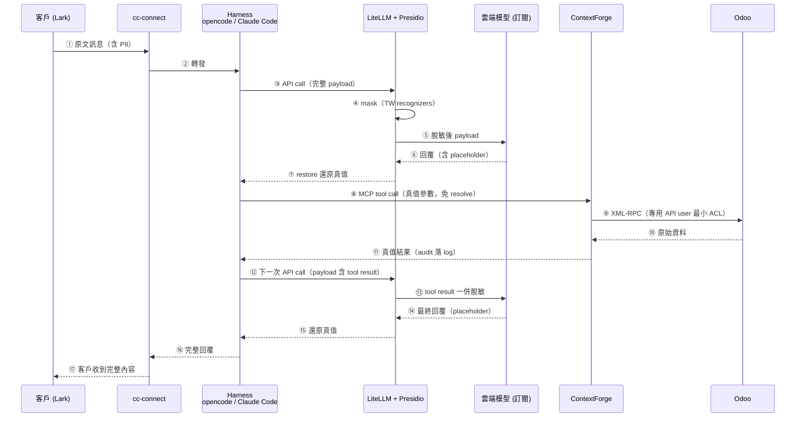
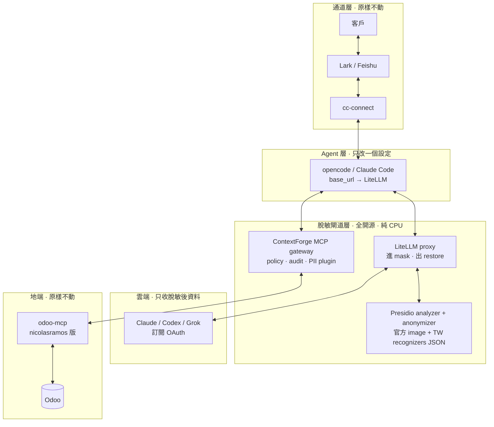
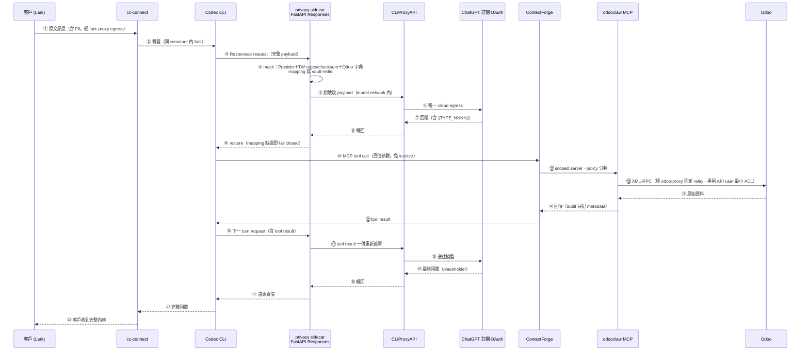
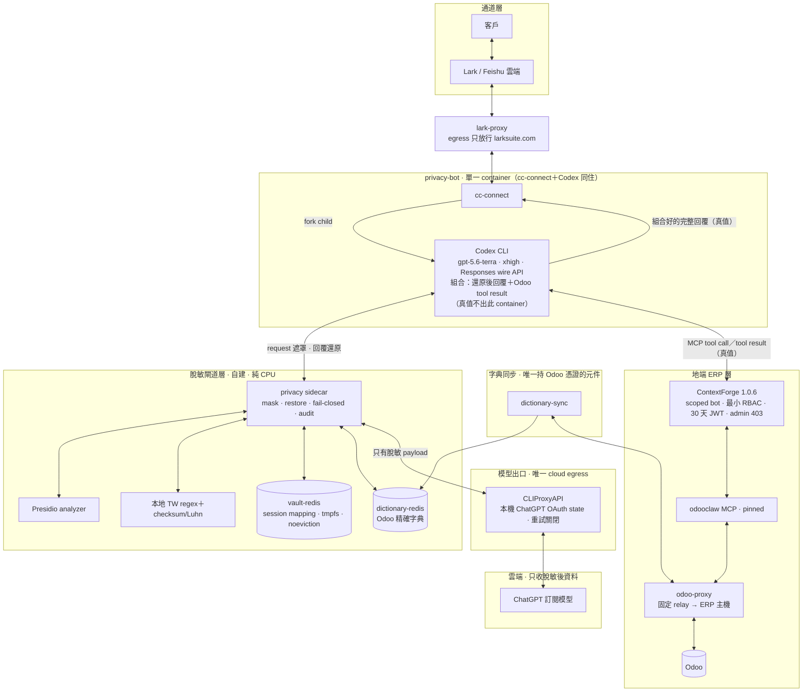

# 06 · 隱私脫敏：訂閱制雲端 agent 的 gateway 架構

> **狀態：架構方向定案，待 spike 驗證後實作。** 本篇是設計紀錄，不是已上線現況；四項 spike 測試（見文末）通過前，下列元件不進 production。
>
> **2026-08-03 更新：已部署上線，實際元件與下文的 LiteLLM 方案不同。** Spike 後改採自建 privacy sidecar；實際架構、圖與驗收結果見文末〈更新：實際部署架構（2026-08-03）〉。下文完整保留為 spike 前的原始設計紀錄。

OSSLab-agent 只採訂閱制 runtime（Codex、Grok、Claude Code 等 OAuth 登入的 harness），但工作負載充滿個資：Lark 客戶對話、Odoo 客戶與訂單資料、大量客服 email 讀取、PDF 報價文件編寫。這些資料在進入雲端模型之前必須脫敏，回覆送出前再還原。核心原則只有一條：

**真值永遠停在脫敏閘道以左（地端），雲端模型只看到 placeholder。**

## 先釐清：MCP 和 XML-RPC 不是二選一

評估初期曾問「脫敏用 MCP 還是 XML-RPC 做」——這是假對立。MCP server 內部本來就用 XML-RPC／JSON-RPC 連 Odoo；真正的決策是**脫敏放在哪一層**。候選有三：

| 層 | 做法 | 結論 |
| --- | --- | --- |
| Tool 層（自建） | 自建 pii-sidecar（Presidio＋Redis vault）＋cc-connect 進出 hook＋MCP 脫敏 middleware | 控制力最強，但三個自建元件，工程量高 |
| Gateway 層（現成品） | LiteLLM proxy 內建 Presidio guardrail，進線 mask、出線 restore，config 完成 | **採用**：工程量從「建系統」降成「部署＋YAML」 |
| LLM API 代理 | 訂閱制 OAuth 過代理的可行性原被存疑 | 經查證：LiteLLM 支援 Claude Code `ANTHROPIC_BASE_URL` 指向代理；opencode 更可直接自訂 provider。穩定性列入 spike |

## 架構總覽

### 資料怎麼流（round trip）



關鍵機制：LiteLLM 在 ⑦ 把 placeholder 還原後，harness 拿到的就是真值，因此 **MCP tool call 不需要任何 resolve 機制**（⑧ 直接用真值查 Odoo）；而 Odoo 撈回的原始資料會在下一次 API call 的 payload（⑫）裡被 pre_call mask 一併蓋掉（⑬）。**脫敏與還原只存在一個元件裡**，cc-connect、odoo-mcp、Odoo 全部原樣不動。

### 要部署什麼（component view）



## 元件清單（全部開源、純 CPU，不佔用 GPU 營收機器）

| 元件 | 來源 | 職責 | 要寫的東西 |
| --- | --- | --- | --- |
| LiteLLM proxy | [BerriAI/litellm](https://github.com/BerriAI/litellm) | LLM API 閘道；`output_parse_pii: true` 進線 mask、出線還原；virtual key 依 agent 綁 model allowlist／預算 | `config.yaml` guardrail 設定 |
| Presidio analyzer / anonymizer | [microsoft/presidio](https://github.com/microsoft/presidio) 官方 Docker image | PII 偵測與遮罩引擎 | 台灣 recognizer JSON（`presidio_ad_hoc_recognizers`）：身分證字號、統一編號、09 手機 regex＋context |
| ContextForge MCP gateway | [IBM/mcp-context-forge](https://github.com/IBM/mcp-context-forge) | MCP 層 tool allowlist、approval workflow（人工確認閘門）、audit、PII plugin（`tool_pre_invoke`／`tool_post_invoke`） | plugin config YAML |
| odoo-mcp | [nicolasramos/odoo-mcp](https://github.com/nicolasramos/odoo-mcp) | Odoo MCP server（自帶 allowlist／redaction／audit logging） | 原樣使用，接專用 API user |
| Odoo 專用 API user | 既有 Odoo | 最小 ACL —— 脫敏漏了什麼，暴露面先被權限砍過一輪 | 權限設定 |

最小 guardrail 設定範例：

```yaml
guardrails:
  - guardrail_name: "presidio-pii"
    litellm_params:
      guardrail: presidio
      mode: "pre_call"
      output_parse_pii: true          # 出線自動還原 placeholder
      pii_entities_config:
        PERSON: "MASK"
        PHONE_NUMBER: "MASK"
        EMAIL_ADDRESS: "MASK"
      presidio_ad_hoc_recognizers: "./tw_recognizers.json"
```

## 同一閘道，兼任權限控管

脫敏不是這層唯一的功能。訂閱制 agent 的**所有 LLM 流量與 MCP 呼叫都必經這兩台 gateway**，正好把[〈03 · 管理與治理〉](03-agent-governance.md)的治理原則落到實處，不必在 agent 本體上動手：

| 治理原則（03 篇） | 在閘道層的做法 |
| --- | --- |
| 一人一個專屬 agent／權限最小化 | LiteLLM **virtual key**：每個專屬 agent 一把 key，各自綁 model allowlist、rate limit 與預算上限；ContextForge 依 agent 切 tool allowlist；odoo-mcp 再疊 allowlist／denylist；Odoo 專用 API user 最小 ACL 做底 |
| 高風險動作要可停 | ContextForge approval workflow：寫入、刪除、寄信類 tool call 卡**人工確認**才放行；危險工具可直接 deny |
| 過程要能回看 | LiteLLM 記每一次 LLM 請求（含 guardrail 偵測到的實體與遮罩紀錄），ContextForge 記每一次 tool call —— 同一份 audit 同時回答「agent 看到什麼資料」與「agent 做了什麼操作」 |

也就是說，「管理的單位是工作流，不是模型」在這裡多了一個具體落點：**能力邊界與資料邊界集中在閘道層，以 YAML 管理、進 Git 留痕**；調整權限或脫敏政策不用改 agent，也不用碰 cc-connect 與 Odoo。

## 工作負載對應

> 兩張圖的 PNG／SVG 已匯出至 [`docs/assets/`](../assets/)（`06-masking-sequence.*`、`06-masking-component.*`），供 Lark 文件、簡報等不渲染 mermaid 的場合使用；`.mmd` 原始碼即內嵌於本篇，修改後重繪即可。

| 負載 | 路徑 | 說明 |
| --- | --- | --- |
| Lark 客戶對話 | ①–⑰ 全程 | 回覆採「還原後完整送出」：對象是客戶本人，PII 本來就是他自己的資料；脫敏要防的邊界是雲端模型供應商，不是 Lark |
| Odoo 查詢 | ⑧–⑬ | 真值參數查、真值結果回，進雲端前被 mask；訂單號／物流單號是查詢鍵不是個資，不遮 |
| 大量 email 讀取（lark-cli） | 同 tool call 路徑 | 最 PII 密集的 free-text；中文姓名／地址 NER 是弱點，列入 spike 驗證，必要時以 Odoo 客戶主檔做精確值遮罩補強 |
| PDF 文件編寫 | ⑦／⑮ 之後 | harness 拿到的已是真值，本地渲染器直接出 PDF；檔案本身不進雲端 |

## 為什麼不全地端

地端模型（opencode＋open LLM）是架構上最簡單的路——整套脫敏都可以不做——但公司的 GPU 機器（DGX Spark、Mac M4 Max 128G、RTX PRO 6000 96G）是營收用途，常駐跑客服 agent 的機會成本遠高於訂閱費；且先前實測體感慢、品質不足。結論：**全地端留作方案二後備**，地端硬體唯一可選角色是閒置時兼任 Presidio 的中文 NER 偵測後端（容器級負載，隨時可停）。

## 上線前 spike 測試（不通過就不進 production）

1. **opencode 走 LiteLLM**：streaming＋tool call 全開，驗證 guardrail 在串流與工具呼叫路徑正常（LiteLLM 在 Anthropic native API、streaming、tool call 上有[已知還原 issue](https://github.com/BerriAI/litellm/issues/22821)，我們的 stack 全中）。
2. **Placeholder 碰撞**：一封對話塞兩個人名。LiteLLM placeholder 是類型式（`[PERSON]`）不編號，多實體場景還原是否會錯置——客服場景天天多實體，這是最高風險項。
3. **台灣識別碼命中率**：身分證字號、統一編號、09 手機 regex 的 recall／誤判率。注意 ad-hoc recognizer 只吃 regex＋context，跑不了 checksum 驗證（需自建 Presidio image 才能用 code 級 recognizer）。
4. **訂閱 OAuth 過代理**：Claude Code（`ANTHROPIC_BASE_URL`）與 Codex（ChatGPT OAuth）經 LiteLLM 轉發的穩定性；opencode 為首選，因其自訂 provider 最乾淨。

## 已知邊界

- **附件／照片是漏洞**：客戶傳身分證照片，文字脫敏蓋不到；先阻擋附件進雲端，OCR＋脫敏列二期。
- **群組場景**：若多人共用同一對話，還原需按 sender 切分，避免 A 客戶資料還原給 B 客戶看；不確定就先對群組停用還原（回覆保留 placeholder）。
- **gateway 方案的取捨**：相對自建 sidecar，放棄了「Odoo 客戶主檔預填 vault 做精確遮罩」與 session 級編號 placeholder；email 脫敏品質回歸 NER 本位。哪項 spike 掛了，就只為那一項補自建元件，不整锅退回。

## 參考

- [LiteLLM Presidio PII masking](https://docs.litellm.ai/docs/proxy/guardrails/pii_masking_v2) 與[教學](https://docs.litellm.ai/docs/tutorials/presidio_pii_masking)
- [Presidio custom recognizers](https://presidio.dataprivacystack.org/analyzer/adding_recognizers/)；台灣身分證 recognizer 上游尚缺（[issue #2065](https://github.com/data-privacy-stack/presidio/issues/2065)），檢查碼算法參考 [identity.tw](https://identity.tw/)
- [IBM ContextForge plugins](https://ibm.github.io/mcp-context-forge/using/plugins/plugins/)
- [nicolasramos/odoo-mcp](https://github.com/nicolasramos/odoo-mcp)；候選 [ivnvxd/mcp-server-odoo](https://github.com/ivnvxd/mcp-server-odoo)、[muk_mcp](https://github.com/muk-it/odoo-modules/tree/19.0/muk_mcp)（Odoo 內掛 addon 路線）

## 更新：實際部署架構（2026-08-03）

> 以上全文保留為 spike 前原始設計。Spike 結論：**LiteLLM 方案未採用**，實際部署改為自建 FastAPI privacy sidecar＋Codex CLI＋CLIProxyAPI，並已通過完整驗收上線。Normative 規格與驗收紀錄在 Forgejo `osslab/privacy-masking-gateway` 的 `docs/specification.md` 與 `docs/verification.md`；此節只記差異與 as-built 架構。

### 為什麼換掉 LiteLLM（spike 結論）

- LiteLLM 在原生 Responses／SSE 串流／tool payload 的**多實體還原 round-trip** 有上游已知風險（[#22821](https://github.com/BerriAI/litellm/issues/22821)、[#24291](https://github.com/BerriAI/litellm/pull/24291)），我們的 stack 全中。
- 上游追蹤至 2026-08：#22821 雖已 closed（僅修 Anthropic native 路徑，實際 merged 的是 [#30028](https://github.com/BerriAI/litellm/pull/30028)，follow-up [#30316](https://github.com/BerriAI/litellm/pull/30316) 仍 open）；對本 stack 最關鍵的 [#31950](https://github.com/BerriAI/litellm/issues/31950)（OpenAI-compat 路徑 `tool_calls[].function.arguments` 永不還原）**仍 open**，修復 PR [#32014](https://github.com/BerriAI/litellm/pull/32014) 已存在且經第三方 live 驗證，卻躺一個月無 maintainer review。Round-trip 可靠性是上游不可控變數，這正是當初改自建的理由，至今成立。

### 原始四項 spike 的實際處置

| 原始 spike | 處置 |
| --- | --- |
| opencode＋LiteLLM streaming／tool call | 未採用該組合；改 **Codex CLI＋自建 sidecar**，non-stream、SSE、tool call、multi-turn 均通過 Gate 1 |
| 未編號 placeholder 多實體碰撞 | 改 session-scoped `⟦TYPE_NNNN⟧` 雙向 mapping（HMAC session key，存獨立 vault-redis，TTL 3600s） |
| 台灣識別碼命中率 | Presidio＋本地 regex＋checksum/Luhn＋**Odoo 精確字典**（dictionary-sync 同步客戶主檔）＋中英文姓名 fallback |
| 訂閱 OAuth 經 proxy | 採 Codex ChatGPT OAuth＋CLIProxyAPI；Claude Code／LiteLLM 路徑未部署、不在驗收範圍 |

### 實際資料流（as-built round trip）



關鍵機制與原設計相同：模型輸出的 masked tool arguments 由 sidecar 還原後 Codex 才呼叫 MCP（⑩ 真值免 resolve）；Odoo 撈回的資料在下一 turn request（⑯）裡被同一 sidecar 重新遮罩（⑰）。**遮罩與還原仍只存在一個元件**，但這個元件從 LiteLLM 換成自建 sidecar——round-trip 邏輯自有、31 個 contract tests 全覆蓋。

### 實際元件（as-built component view）



與原 component view 的差異：LiteLLM proxy 換成自建 sidecar；還原狀態從 LiteLLM 內部移到獨立 **vault-redis**；新增 **dictionary-redis／dictionary-sync**（Odoo 精確字典，只有 sync 元件持 Odoo 憑證）；模型出口固定為 **CLIProxyAPI**（唯一有 Internet egress 的模型元件）；odoo-mcp 換成 pinned **odooclaw**；全部服務以 **Docker network segmentation** 隔離，host 只綁 `127.0.0.1:18400`／`:18444`。

> 兩張 as-built 圖的 PNG／SVG 已匯出至 [`docs/assets/`](../assets/)（`06-asbuilt-sequence.*`、`06-asbuilt-component.*`）；`.mmd` 原始碼即內嵌於本節，重繪方式同文末附錄。

### 驗收狀態（verification.md 摘要）

- **25 項 acceptance 全 PASS**：31 contract tests、Gate 1（non-stream／SSE／tool call／multi-turn、八類合成 PII 遮罩還原）、Gate 2 fail-closed（刪 session mapping 後無 partial response、無 plaintext error）、ContextForge RBAC（bot 僅 `servers.read/use`＋`tools.read/execute`，admin API 403）、Odoo policy allow/deny、Lark live E2E（合成 PII 經 Odoo MCP read 精確還原）、network matrix 實測隔離、container log／git secret scan 零命中。
- **未聲稱通過**（與原「已知邊界」對應）：附件圖片／PDF／audio OCR 脫敏——尚未實作，現況是**阻擋**；正式 Odoo write flow 未做 live mutation；無 corpus 級 recall／false-positive benchmark；無大規模 soak。
- 完整 acceptance matrix 與重跑方式見 `docs/verification.md`。

### 後續候選：金額遮罩（AMOUNT 字典）

針對「非 PII 但商業敏感的金額」上雲的殘餘風險，最小切片做法已評估：dictionary-sync 增拉 `sale.order.amount_total`、`account.move.amount_total` 等欄位 → dictionary-redis 新增 `AMOUNT` entity → sidecar 精確比對。骨架現成（`ENTITY_KEYS` 加一類、sync 加查詢），但上線前要決三題：只遮 Odoo 輸出還是連人手打格式也遮（表面形式 variants 會膨脹字典）、誤殺門檻怎麼定（≥1000 或要求千分位，避免遮到 `16GB`／`512GB` 規格數字）、以及**遮掉金額後模型不能做金額推理**（placeholder 不保序不可計算）——是否接受取決於業務問句型態。

上一篇：[〈LarkSuite 作為 AI agent channel 的三方 review〉](05-larksuite-as-ai-agent-channel-review.md)

### 附：重繪指令

圖檔以 mermaid 原始碼為準，匯出使用 [mermaid-skill](https://github.com/Agents365-ai/mermaid-skill) 流程（validate → export → vision self-check）：

```bash
mmdc -i diagram.mmd -o diagram.png -w 2048 --backgroundColor white
```
